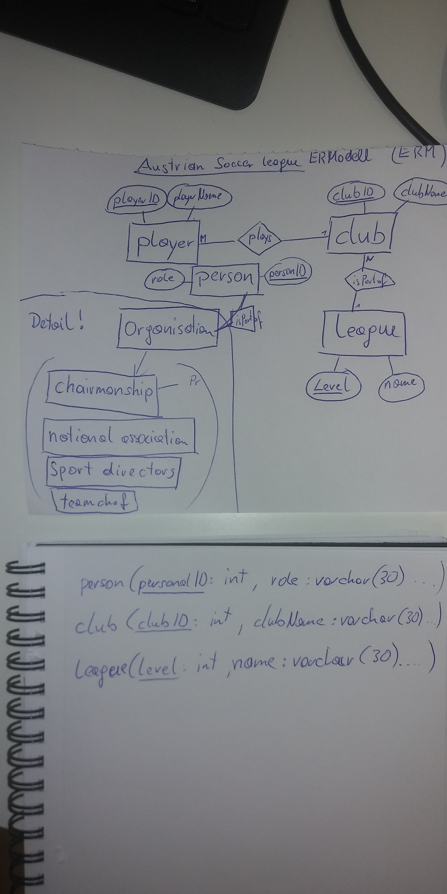

# Austrian Soccer League ERM

### first solution

### second solution

####ERM:

####textual notation:

* player ( **playerID**:INT, firstname:VARCHAR(32), lastname:VARCHAR(32) , position:VARCHAR(32) )

* playerstatistics ( *playerID*:INT, *saison*:VARCHAR(32), goals:INT, yellowcards:INT, redcards:INT, playtime:INT )

* players_of_a_team (*teamID*:INT, *playerID*:INT )

* club( **clubID**:INT, name:VARCHAR(32), homestadion:VARCHAR(32) )

* team( **teamID**:INT, *clubID*:INT, *playerID*:INT, *trainer*:INT, leaguelevel:INT)

* person ( **personID**:INT, firstname:VARCHAR(32), lastname:VARCHAR(32), role:VARCHAR(32), *clubID*:INT )

* saisonplan ( **saison**:VARCHAR(32), date:DATE, tookplace:BOOLEAN , stadion:VARCHAR(32),  *team1*:INT, *team2*:INT, 
scoreteam1:INT, scoreteam2:INT)

####DB schema:

[DB Schema link](SoccerLeagueDB_schema.pdf)